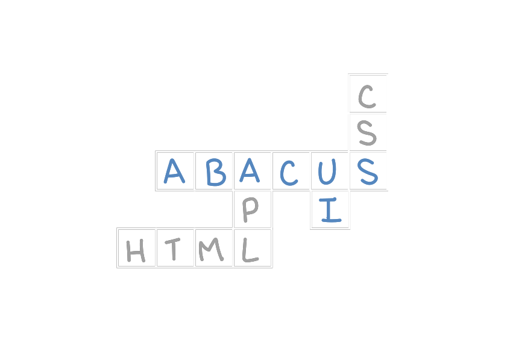

> Take care of the code, be gentle to the computer, and make beautiful stuff on your screens.

Håkon Wium Lie 

# Abacus UI, an HTML Framework for Dyalog APL

(See the wiki for documentation) 

## HTML

Easy, catenate-free construction and manipulation of HTML with a document object model - an APLDOM.

## HTMLRenderer

Cross-platform desktop HTML UI using Dyalog's HTMLRenderer,
with JavaScript-free APLDOM-to-Browser synchronization. 

## CSS

Easy, dynamic construction of CSS.

## Component Library

Encapsulate HTML, CSS and functionality for reusable web components.

## Markdown

Convert markdown to HTML.
