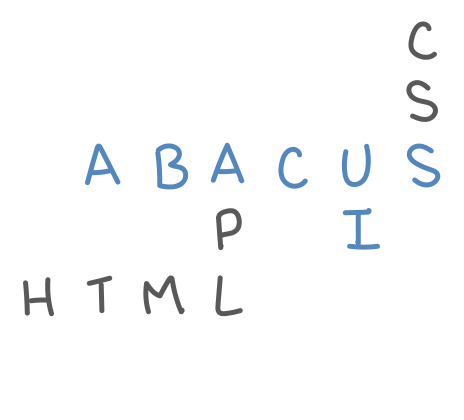

<picture>
  <source media="(prefers-color-scheme: dark)" srcset="PuzzleDark.svg">
  <source media="(prefers-color-scheme: light)" srcset="PuzzleLight.svg">
  
</picture>

> *Take care of the code, be gentle to the computer, and make beautiful stuff on your screens.*

Håkon Wium Lie 

# Abacus UI, an HTML Framework for Dyalog APL

### Documentation Update (11/18/2025)
Up until now, the documentation, such as it is (more like development notes really), has been scattered on the associated
repo [wiki](https://github.com/the-carlisle-group/Abacus/wiki) and on the [ToolOfThought](https://toolofthought.com) blog.
We are now making a concerted effort to formalize the documention [here](https://the-carlisle-group.github.io/Abacus/), using another Carlisle Group open source 
project [Exigo](https://github.com/the-carlisle-group/Exigo). Just starting, so totally incomplete, and please excuse the (lack of CSS), but it should fill out quickly.

## HTML

Easy, catenate-free construction and manipulation of HTML with a document object model - an APLDOM.

## HTMLRenderer

Cross-platform desktop HTML UI using Dyalog's HTMLRenderer,
with JavaScript-free APLDOM-to-Browser synchronization. 

## CSS

Easy, dynamic construction of CSS.

## Component Library

Encapsulate HTML, CSS and functionality for reusable web components.

## Markdown

Convert markdown to HTML.

<picture>
  <source media="(prefers-color-scheme: dark)" srcset="AbacusDark.svg">
  <source media="(prefers-color-scheme: light)" srcset="AbacusLight.svg">
  
</picture>

